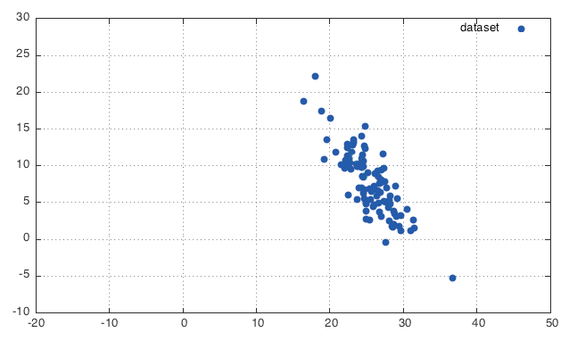
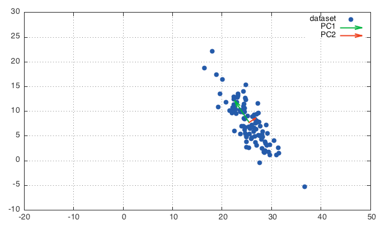
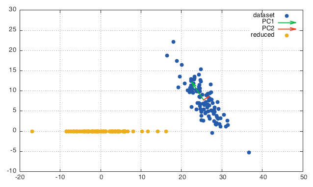

# PCA
[*Principal component analysis*](http://en.wikipedia.org/wiki/Principal_component_analysis) (*PCA*) finds the directions of greatest variance in a dataset.

## Why do we care?
PCA can do a great deal of useful things such as:

 - speed up training;
 - 2/3D representation of data living in *n*-D, *n* > 3;
 - data augmentation by aligned perturbation;
 - ZCA whitening.

It can of course as well screw up everything (see [Feldman's blog post](http://blog.explainmydata.com/2012/07/should-you-apply-pca-to-your-data.html), for example).

## How does it work?
To find the *first component*, PCA looks for a **linear combination of the elements of your dataset's vectors, which explains the highest variation of the data**. Think of it as the *versor* on which, the projection (*dot product*) of the dataset will have its highest variability.
For the *second component*, PCA looks for another (linear) combination — i.e. another *versor* — **orthogonal to the first one**, which explains the second highest variation of the data.
For the third, same story. In this case, the elements's combination has to be vertical to all previously found one. Etc…

## What is used for?

### Dimensionality reduction
For each *versor*, *principal component* or *eigenvector* there is an associated *power* (or *energy*, if square rooted), *variance* (or *standard deviation*, if square rooted) or *eigenvalue* which tells us the "amount of variability" in that direction. What happens often is that only the first few components have non-neglectable variance. Hence, data dimensionality can be greatly reduced with little loss of information.
In turn, dimensionality reduction can be used to perform a series of tricks, such as *training speed-up* and *2/3D visualisation of high dimensional data* I mentioned above.

### Acquiring knowledge of variance distribution
Knowing the *direction* and the *amount* of variance of our data allows us, by playing smartly with them, to achieve reasonable *data augmentation* and *data spherificatoin*. More about it will be said later, in these notes.

## OK, let's get our hands dirty with PCA
So, after all this chatting, let's get a bit more specific with a case study.
Let's think we have a data living in a 2D space — with an uneven distribution — we'd like to compress into 1D, i.e. onto a line.
So, this is how the data looks like



This data is said to be *correlated*. This means that all data points' components are somehow meaningful. Let's run PCA



```lua
eigenvectors (colums):
-0.5488  0.8359
 0.8359  0.5488
[torch.DoubleTensor of dimension 2x2]

eigenvalues (power/variance):
 27.2135
  2.3272
[torch.DoubleTensor of dimension 2]

sqrt of the above (energy/std):
 5.2167
 1.5255
[torch.DoubleTensor of dimension 2]
```
Great. Now we have the direction of highest variability (1st component) and its orthogonal one.
Let's look at the text output. Here we can see that the total *energy* / *information* of `5.44` (= √[`27.2` + `2.33`]) is spread unevenly across the components. `5.22` on the first and `1.53` on the second one. This means that, if we project the dataset onto the first component and discard the second one, we would retain 92.1% (= `27.2`/[`27.2` + `2.33`]) of the *variance*.
OK, it looks like cool. Let's project



Great! Now we have data along only 1 dimension which have a variability very close to the original data.
Notice how the "spare datapoint" at south-east in the original data is mapped on the far-west in the projected replica. This is because the "green arrow" of the first component is pointing on the opposite direction, hence the projection will be "very negative".
Notice also the 5 datapoints at north-west in the original data, are eavenly separated in the far-east projected data.

### Conclusion
Cool. Now we know how to reduce data dimensionality. In turn, this means we can speed up our training (by using less input data) and we are able to visualise data living in high-D onto 3/2/1D.

### Run the script
Running the script is pretty simple. All you need is to read the instruction at the top of the file and run Torch interactively.

```
th -i PCA.lua
```

### The algorithm
The script I've used so far is [`src/PCA.lua`](src/PCA.lua). *PCA* and *projection* are shown below.

```lua
-- PCA -------------------------------------------------------------------------
-- X is m x n
mean = torch.mean(X, 1) -- 1 x n
m = X:size(1)
Xm = X - torch.ones(m, 1) * mean
Xm:div(math.sqrt(m - 1))
v,s,_ = torch.svd(Xm:t())
s:cmul(s) -- n

-- Projection ------------------------------------------------------------------
X_hat = (X - torch.ones(m,1) * mean) * v[{ {},{1} }] -- m x 1
```

`X`, a `m` × `n` matrix, contains our dataset by rows; in this case `m` = `100` and `n` = `2`, i.e. we have `100` `2`-dimensional datapoints. `X_hat` is our projected data onto the *first component* `v[{ {},{1} }]`.
